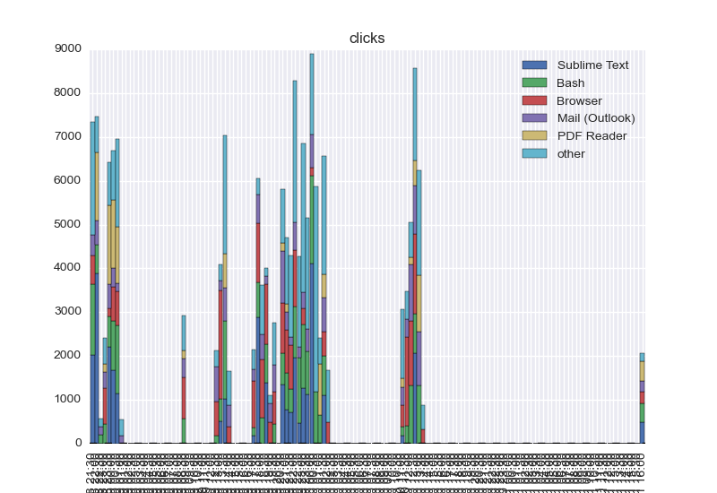
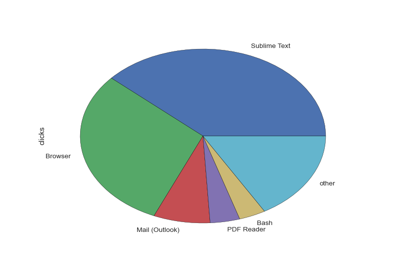
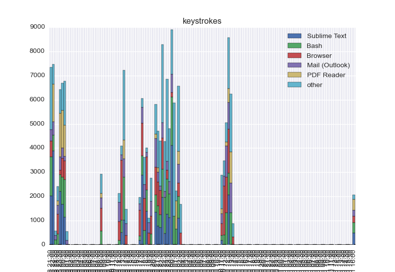
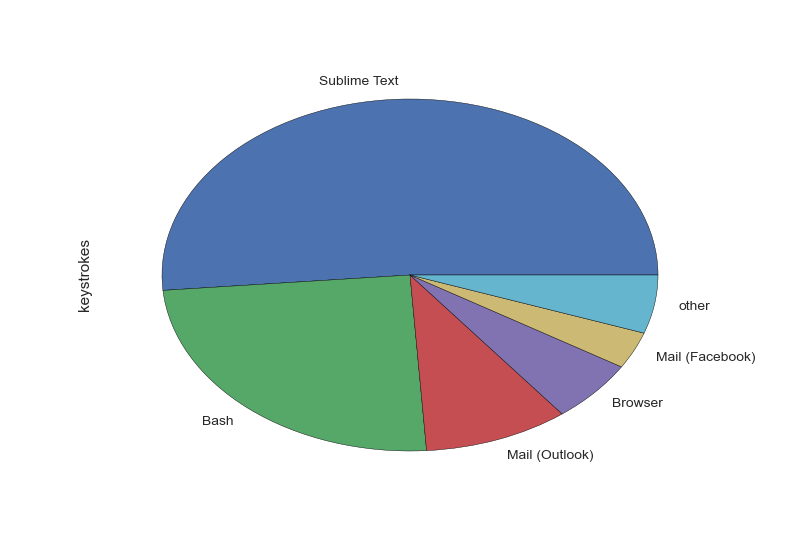

# Visualization for selfspy | Plots for selfstats
## Examples
### :mouse: *Clicks*
#### Last hours (*bar* chart)

#### Total (*pie* chart)

### :musical_keyboard: *Keystrokes*
#### Last hours (*bar* chart)

#### Total (*pie* chart)

### Other visualizations
> Not yet :santa:.

----

## Command line
The graphs above have been generated by these commands.

You need to add [selfvis.py](./selfvis.py) in your PATH.
And then run:

    $ selfvis.py --human-readable --pactive --back 8 h

Or:

    $ selfvis.py --human-readable --ratios --back 8 h

----

## Installation
Install [selfspy](https://github.com/gurgeh/selfspy), then the requirements with [pip](http://www.pip-installer.org/) :

    $ pip install -r requirements.txt

You might need to give it [sudo rights](https://help.ubuntu.com/community/RootSudo) :

    $ sudo pip install -r requirements.txt

## Usage
The script is a modified version of the [`selfstats` program](https://github.com/gurgeh/selfspy#example-statistics).
The same options apply. Try e.g.

    $ python selfvis.py

## Code status
Currently implemented is a breakdown of hours (stacked bar chart) and a pie
chart (all time totals).
Both plots are saved for [clicks](clicks-total.png) and for [keypresses](keystrokes-total.png), respectively.

It's very likely that long intervals aren't split correctly.

## :wrench: Options
Filtering options of original `selfstats` continue to work.
[See here](https://github.com/gurgeh/selfspy#selfstats-reference).

----

## :memo: Config
In  `~/.selfspy/simplification_rules.txt`, add rules of the form
``regexp --> name``

For examples:

    ^\s*::\s*$ --> unknown
    ^(.+)::\s*$ --> \1
    ^(.+)::.*$ --> \1
    # ^(.+)::(\w+).*$ --> \1:\2
    ^Firefox::.*YouTube.*$ --> Browser (Youtube)
    ^Firefox::.*GitHub.*$ --> Browser (GitHub)
    ^Firefox::.*Google Search.*$ --> Browser (search)
    # ^.*Skype.*$ --> Skype
    # ^.*Zimbra.*$ --> Mail
    # ^.*\bmutt\b.*$ --> Mail
    # ^.*\bzsh\b.*$ --> shell

to keep descriptions in legends short and expressive.
Last matching rule (LHS) wins.

See [this example](./simplification_rules.txt) for the rules I like.

----

## FAQ :mag:
#### Q: *Is there a nice webpage to display the graphs?*
> A: Yes, use [this HTML file](./selfvis.html), **host it locally**.

1. Download it [raw from here](https://cdn.rawgit.com/Naereen/selfspy-vis/master/selfvis.html),
2. Put it somewhere where your **local** web server can find it (``~/Public/``, ``~/www/`` or whatever, depending on your system),
3. Generate the graphs in the same folder (you can do it on a daily basis, e.g. with [a cron job](https://help.ubuntu.com/community/CronHowto),
4. Access the page on your web-browser. Tadaa!

> It uses [StrapDown.js](https://github.com/Naereen/StrapDown.js).

#### Q: *Is it supposed to be that slow?*
> A: Yup, don't expect your graphs to be produced in two seconds, it can take up-to 15 seconds.

> A: Note: You can use an option to shorten the time window used for the plot: for instance ``selfvis.py --back 8 h`` only uses the data from the last 8h.

#### Q: *Can I ...?*
> A: Yes, as long as you respect [the terms of the GPLv3 License](./LICENSE).

----

## :information_desk_person: About
### :pencil: Authors?
- [Forked by](https://github.com/Naereen/selfspy-vis/): [Lilian Besson (Naereen)](https://github.com/Naereen/),
- Original author: [Hannes Schulz (temporaer)](https://github.com/temporaer/selfspy-vis).

## :scroll: License ? 
[GPLv3 Licensed](http://perso.crans.org/besson/LICENSE.html) (file [LICENSE.txt](LICENSE.txt)).
© [Lilian Besson](https://GitHub.com/Naereen), 2016-17.

